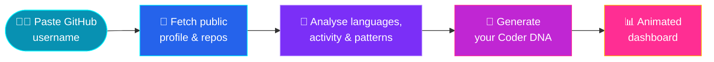

<div align="center">


<a href="https://git.io/typing-svg">
  
</a>

<br/>


</div>

---

## 🧬 What is CoderDNA?

> **Your code leaves a fingerprint. CoderDNA reads it.**

**CoderDNA** turns a GitHub username into a visual, shareable *developer genome*. Drop in a profile and watch it get decoded into charts, traits, and a coding identity that goes far beyond a contribution graph.

No sign-up. No setup. **Paste. Decode. Discover.**

<div align="center">

```
  GitHub Username  ──▶  Fetch Public Data  ──▶  Analyse Patterns  ──▶  Your Coder DNA 🧬
```

</div>

---

## ✨ Features

<table>
<tr>
<td width="50%" valign="top">

### 🔬 Profile Decoding
Paste any public GitHub profile and CoderDNA analyses the repos, languages, and activity behind it.

### 📊 Interactive Charts
Language mix, activity patterns, and repo stats come to life through animated, hoverable **Recharts** visualisations.

</td>
<td width="50%" valign="top">

### 🧠 Developer Identity
See what kind of coder you are, with traits and patterns distilled from your public work.

### 🎞️ Silky Animations
Every reveal, transition, and counter is powered by **Framer Motion** for a polished, cinematic feel.

</td>
</tr>
<tr>
<td width="50%" valign="top">

### ⚡ Instant Results
Built on **Vite** and **React 18**, so it's fast on first load and snappy on every interaction.

</td>
<td width="50%" valign="top">

### 🌙 Sleek, Modern UI
A **Tailwind CSS** design system with crisp **Lucide** icons, built to look great on desktop and mobile.

</td>
</tr>
</table>

---

## 🧪 How It Works



---

## 🖼️ Preview

<div align="center">

<!-- Replace with real screenshots or a GIF, e.g. ./assets/preview.gif -->


</div>

---

## 🛠️ Tech Stack

| Layer | Technology |
| :-- | :-- |
| ⚛️ **Framework** | React 18 + TypeScript |
| ⚡ **Build Tool** | Vite 5 |
| 🎨 **Styling** | Tailwind CSS 3 + PostCSS |
| 🎞️ **Animation** | Framer Motion |
| 📈 **Charts** | Recharts |
| 🔣 **Icons** | Lucide React |
| 🗄️ **Backend / DB** | Supabase |
| 🧹 **Quality** | ESLint 9 + typescript-eslint |

---

## 🚀 Getting Started

### ✅ Prerequisites


### 1️⃣ Clone the repo

```bash
git clone https://github.com/Aditya-Khubalkar/CODERDNA.git
cd CODERDNA
```

### 2️⃣ Install dependencies

```bash
npm install
```

### 3️⃣ Configure environment variables

Create a `.env` file in the project root:

```env
VITE_SUPABASE_URL=your_supabase_project_url
VITE_SUPABASE_ANON_KEY=your_supabase_anon_key
```

> 🔐 Never commit your `.env` file. It's already covered by `.gitignore`.

### 4️⃣ Run the dev server

```bash
npm run dev
```

> 🌐 Open **http://localhost:5173** and decode your DNA.

---

## 📜 Available Scripts

| Command | What it does |
| :-- | :-- |
| `npm run dev` | 🔥 Start the Vite dev server with HMR |
| `npm run build` | 📦 Create an optimised production build |
| `npm run preview` | 👀 Preview the production build locally |
| `npm run lint` | 🧹 Lint the codebase with ESLint |
| `npm run typecheck` | 🔍 Type-check with TypeScript |

---

## 🗺️ Roadmap

- [ ] 🧬 Shareable DNA cards (export as image)
- [ ] ⚔️ Compare two developers head-to-head
- [ ] 🏆 Leaderboards and trending coders
- [ ] 🌗 Light / dark theme toggle
- [ ] 🧩 Embeddable README badge for your own profile

---

## 🤝 Contributing

Contributions make the gene pool stronger. 💪

1. 🍴 Fork the repository
2. 🌿 Create a branch: `git checkout -b feature/amazing-feature`
3. 💾 Commit your changes: `git commit -m "feat: add amazing feature"`
4. 📤 Push the branch: `git push origin feature/amazing-feature`
5. 🔁 Open a Pull Request

---

<div align="center">

### 🧬 *Your code is your DNA. Go decode it.*

⭐ **If CoderDNA impressed you, drop a star. It fuels the next mutation.** ⭐

<br/>

Built with ❤️ and way too much caffeine by [**Aditya Khubalkar**](https://github.com/Aditya-Khubalkar)


</div>
